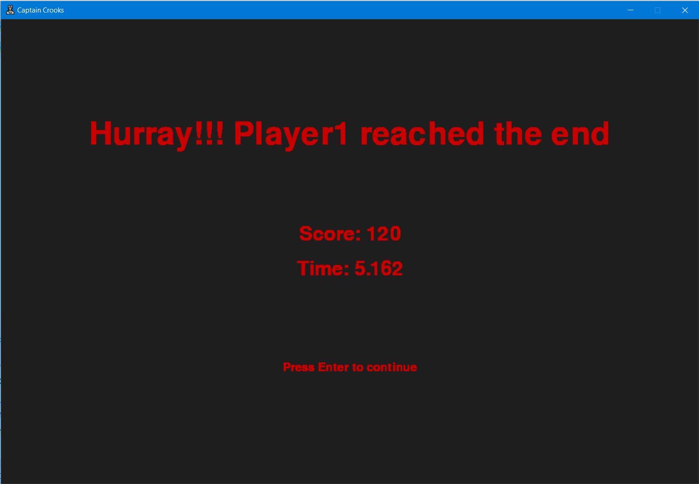

# **Captain Crooks**

A small, fun, time-pass game

**Developer** : 
Akshett Rai Jindal
 
**Language** : 
Python3
  
**Modules** :  
- pygame
- os
- random
- math

## **Features**
- Multiplayer Game
- Easy to play
- Infinte Levels
- Easy Controls

## **Rules**
- In each round, first Player 1 will play, then Player 2 will play
- The goal is to make the tip of space-ship touch the end message
- Winner in each round will be determined considering score and time
- If a player reaches then end and other player doesn't, then player will win the round
- There are two types of obstacles
    - **Fixed**
        -  
    - **Moving**
        -  
- Score on crossing 
    - Fixed Obstacles : 5
    - Moving Obstacles : 10
- There are two types of coins for bonus score
    - **Single Coin** : 10 points
        -  
    - **Group of coins** : 20 points
        - 
- If a player touches the obstacles, he will die and turn of other player will come
- All the moving obstacles move with randomized speeds
- If the player is resting on the slabs, then he is safe from moving obstacles
- If any player remains idle for 5 seconds then 5 points will be deducted if possible without making the score negative

## **Controls**
- Player 1 is controlled by using the **Arrow Keys**
- Player 2 is controlled by
    - **W** : Moving Up
    - **A** : Moving Left
    - **S** : Moving Down
    - **D** : Moving Right
- Pressing down **L Shift** along with above keys increase the speed
- Hitting the **Esc** Key during the gameplay pauses the game
- Pressing **Alt + F4** anywhere closes the game

## **Screenshots**

 

 
 
